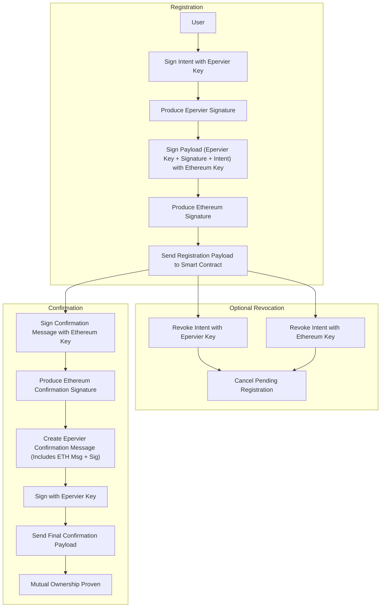
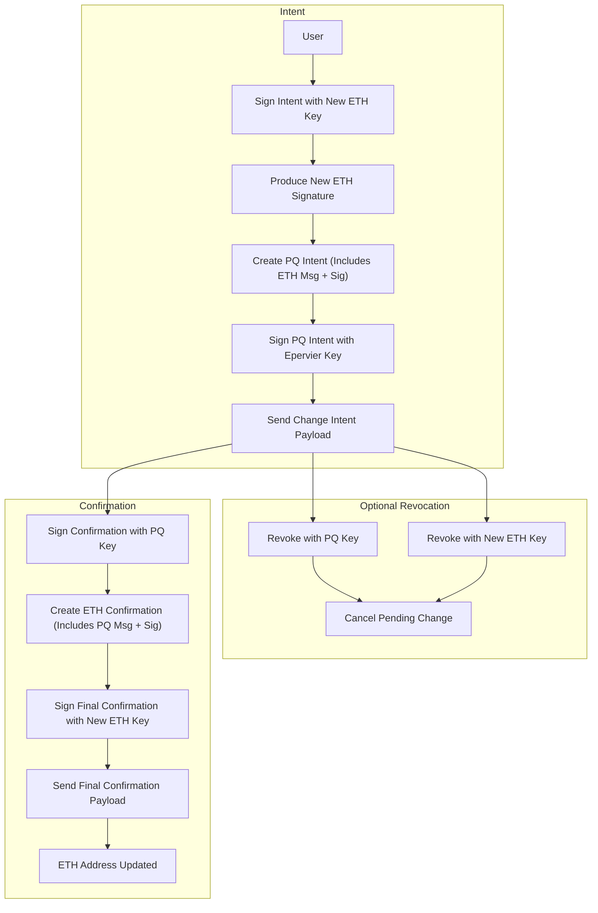
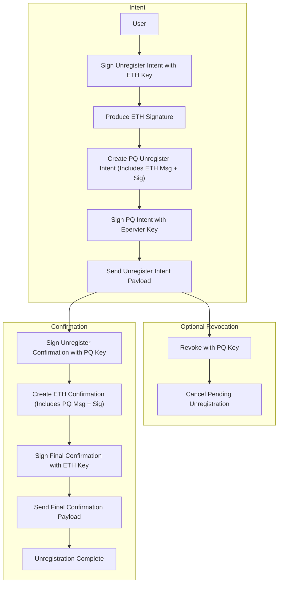

# Epervier Registry - Post-Quantum Smart Contract System

> **⚠️ EXPERIMENTAL SOFTWARE WARNING ⚠️**
> 
> This is an **experimental smart contract stack** built with AI assistance on top of an **unaudited EVM-compatible variant** of the Falcon signature standard created by [ZKNOX/ETHFALCON](https://github.com/ZKNoxHQ/ETHFALCON).
> 
> **🚫 DO NOT USE IN PRODUCTION** - This software is for research and development purposes only.
> 
> **Risk factors:**
> - ⚡ **Experimental cryptography** - ETHFALCON is not yet production-ready
> - 🤖 **AI-assisted development** - Code generated with AI tools requires careful review  
> - 🔬 **Research prototype** - Intended for academic and experimental use only
> - 🚫 **No security audits** - Smart contracts have not undergone professional security audits
> - 🧪 **Unaudited cryptographic implementation** - The underlying ETHFALCON library is experimental

A comprehensive post-quantum cryptographic smart contract system built on Ethereum, featuring quantum-resistant digital signatures and NFT transfers using the Evervier variant of the ETHFALCON signature scheme.

## 🚀 Live Deployment (OP Sepolia)

### Core Contracts

| Contract | Address | Description |
|----------|---------|-------------|
| **PQRegistry** | [`0x18E3bc34fc2645bDCe2b85AF6f9e0ac3cD26637e`](https://sepolia-optimistic.etherscan.io/address/0x18E3bc34fc2645bDCe2b85AF6f9e0ac3cD26637e) | Main registry for post-quantum key management |
| **PQERC721** | [`0x9f6A2b8560FceF521ACe81c651CFd8A07381B950`](https://sepolia-optimistic.etherscan.io/address/0x9f6A2b8560FceF521ACe81c651CFd8A07381B950) | Post-quantum secured NFT contract |
| **EpervierVerifier** | [`0x5ab1d6db02f48bad63cbef5d51c534A76aEB824B`](https://sepolia-optimistic.etherscan.io/address/0x5ab1d6db02f48bad63cbef5d51c534A76aEB824B) | Epervier signature verifier |

### Logic Contracts (Modular Architecture)

| Contract | Address | Purpose |
|----------|---------|---------|
| **MessageParser** | [`0x804B4EDe5f9e37Bd6bbdb0C02629dB80930029D5`](https://sepolia-optimistic.etherscan.io/address/0x804B4EDe5f9e37Bd6bbdb0C02629dB80930029D5) | Parses structured intent messages |
| **MessageValidation** | [`0xDBB242BBF5c6Ea43807Db09F93C8160aa8058bb8`](https://sepolia-optimistic.etherscan.io/address/0xDBB242BBF5c6Ea43807Db09F93C8160aa8058bb8) | Validates message formats and constraints |
| **SignatureExtractor** | [`0x15DC6b3a0Fc5fB51404fC4ed40d125D6aEBf6A3d`](https://sepolia-optimistic.etherscan.io/address/0x15DC6b3a0Fc5fB51404fC4ed40d125D6aEBf6A3d) | Extracts and validates Epervier signatures |
| **AddressUtils** | [`0x283E2d56804D5577d4751885BEeef9cC430c20B0`](https://sepolia-optimistic.etherscan.io/address/0x283E2d56804D5577d4751885BEeef9cC430c20B0) | Address derivation and validation utilities |
| **RegistrationLogic** | [`0xEda9fbfe78df1274B33F81b3d62B6aD287D32fEB`](https://sepolia-optimistic.etherscan.io/address/0xEda9fbfe78df1274B33F81b3d62B6aD287D32fEB) | Handles PQ key registration workflow |
| **UnregistrationLogic** | [`0x0EA8C0Fa222b3EFD3FDdec18b18819130512b01E`](https://sepolia-optimistic.etherscan.io/address/0x0EA8C0Fa222b3EFD3FDdec18b18819130512b01E) | Manages key unregistration process |
| **ChangeAddressLogic** | [`0xAc4fE28b070330aE9644cF06Be0bf48eD01F4913`](https://sepolia-optimistic.etherscan.io/address/0xAc4fE28b070330aE9644cF06Be0bf48eD01F4913) | Handles ETH address changes |

### Network Details
- **Network**: Optimism Sepolia Testnet
- **Chain ID**: 11155420
- **Block Explorer**: [Optimistic Etherscan](https://sepolia-optimistic.etherscan.io/)

## 📖 System Overview

### PQRegistry Contract

The **PQRegistry** is the core contract that manages post-quantum cryptographic key registrations and intent-based operations. It provides a secure, quantum-resistant alternative to traditional ECDSA-based systems.

#### Key Features:
- **Post-Quantum Address Fingerprints**: Epervier signatures use a recovery function that consistently derives deterministic Ethereum-style addresses from PQ signatures, creating unique 20-byte fingerprints for post-quantum keys. While these fingerprint addresses cannot natively control ETH or ECDSA-based tokens, they can own PQ-compatible assets and potentially back smart contract wallets that bridge post-quantum security to traditional Ethereum assets.
- **Hybrid Key Registration**: Users register Epervier public keys linked to their Ethereum addresses, creating a bridge between classical and post-quantum cryptographic systems.
- **Intent-Based Operations**: Supports registration, unregistration, and address change intents with cryptographic proofs and optional revocation.
- **Dual Signature Validation**: Requires both Epervier (post-quantum) and ECDSA (Ethereum) signatures for critical operations, ensuring security in both classical and quantum threat models.
- **Modular Architecture**: Built with separate logic contracts for maintainability and upgradability
- **EIP-712 Compliance**: Uses standard domain separators for secure message signing.

#### Core Operations:
1. **Registration Intent**: Submit intent to register a new PQ key with Epervier signature
2. **Registration Confirmation**: Confirm registration with both Epervier and ECDSA signatures
3. **Unregistration Intent**: Submit intent to remove a PQ key
4. **Unregistration Confirmation**: Confirm unregistration of both PQ and Ethereum keys
5. **Address Change Intent**: Submit intent to change the associated Ethereum address
6. **Address Change Confirmation**: Confirm address changes with proper validation

### PQERC721 Contract

The **PQERC721** extends the standard ERC721 NFT contract with post-quantum transfer capabilities, enabling quantum-resistant NFT ownership and transfers.

#### Key Features:
- **Standard ERC721 Compatibility**: Fully compatible with existing NFT infrastructure
- **Proof of Post-Quantum Keys**: Tokens can only be minted by successfully pairing an Epervier ffingerprint to an Ethereum address
- **Post-Quantum Transfers**: Supports transfers using Epervier signatures instead of ECDSA
- **Registry Integration**: Automatically validates transfers against registered PQ keys

#### Transfer Methods:
1. **Traditional Transfer**: Standard ERC721 transfers using ECDSA signatures
2. **PQ Transfer**: Quantum-resistant transfers using Epervier signatures
3. **Mixed Validation**: Automatically routes transfers based on sender's registered PQ status

## 🔐 Epervier/ETHFALCON Integration

### What is Epervier?

Epervier is an EVM-optimized variant of the ETHFALCON post-quantum digital signature scheme, which is based on the FALCON lattice-based cryptographic algorithm. It provides quantum-resistant signatures that remain secure even against quantum computer attacks.

#### Key Properties:
- **Quantum Resistance**: Secure against both classical and quantum computer attacks
- **Lattice-Based**: Built on the mathematical hardness of lattice problems
- **NIST Standardized**: Based on FALCON, a NIST post-quantum cryptography standard
- **Efficient Verification**: Optimized for blockchain verification with reasonable gas costs

### Integration Architecture

The system implements three primary workflows with dual-signature validation:

#### 1. Registration Workflow


#### 2. Address Change Workflow


#### 3. Unregistration Workflow


### Signature Process

1. **Key Generation**: Users generate Epervier key pairs using the reference implementation
2. **Message Signing**: Intent messages are signed with Epervier private keys
3. **On-Chain Verification**: The EpervierVerifier contract validates Epervier signatures
4. **State Updates**: Successful verifications update the registry state
5. **Dual Authentication**: Critical operations require additional ECDSA confirmation

### Security Model

The system implements a **hybrid security model**:

- **Post-Quantum Security**: Epervier signatures protect against quantum attacks
- **Immediate Compatibility**: ECDSA signatures ensure current Ethereum compatibility
- **Progressive Migration**: Users can opt-in to post-quantum security while maintaining backward compatibility
- **Intent-Confirmation Pattern**: Two-phase operations prevent replay attacks and ensure user consent

## 🏗️ Architecture

### Modular Design

The system uses a modular architecture where logic is separated into dedicated contracts:

- **MessageParser**: Handles structured message parsing and validation
- **SignatureExtractor**: Extracts and validates cryptographic signatures
- **MessageValidation**: Enforces business logic and constraint validation
- **AddressUtils**: Provides address derivation and utility functions
- **Logic Contracts**: Separate contracts for each major operation (registration, unregistration, address changes)

### Benefits:
- **Upgradability**: Logic contracts can be upgraded without changing the main registry
- **Gas Optimization**: Modular design reduces deployment and execution costs
- **Maintainability**: Separation of concerns makes the codebase easier to maintain
- **Testing**: Individual components can be tested in isolation

## 🚀 Getting Started

### For Developers

1. **Clone the Repository**:
   ```bash
   git clone --recurse-submodules https://github.com/your-repo/epervier-registry
   cd epervier-registry
   ```
   
   **Or if already cloned without submodules**:
   ```bash
   git submodule update --init --recursive
   ```

2. **Install Dependencies**:
   ```bash
   forge install
   ```

3. **Set up ETHFALCON CLI**:
   ```bash
   # Navigate to ETHFALCON python environment
   cd ETHFALCON/python-ref
   
   # Create virtual environment (if not exists)
   python3 -m venv myenv
   source myenv/bin/activate
   
   # Install dependencies
   pip install -r requirements.txt
   
   # Return to project root
   cd ../..
   ```

4. **Run Tests**:
   ```bash
   forge test
   ```

5. **Deploy Locally**:
   ```bash
   # Set up local environment
   source script/setup_env.sh
   
   # Deploy to local testnet
   forge script script/DeployLocalEpervier.s.sol --broadcast
   ```

### For Users

1. **Generate Epervier Keys**: Use the ETHFALCON reference implementation to generate post-quantum key pairs
2. **Register Your Key**: Submit a registration intent with your Epervier signature
3. **Confirm Registration**: Provide ECDSA confirmation to complete registration
4. **Use PQ Features**: Transfer NFTs and perform operations using post-quantum signatures

## 📚 Documentation

- [Advanced Testing Plan](test/advanced_testing_plan.md)
- [OP Sepolia Deployment Guide](script/README_OP_SEPOLIA.md)
- [ETHFALCON Documentation](ETHFALCON/README.md)
- [API Reference](docs/)

## 🔬 Research & Development

This project represents cutting-edge research in post-quantum cryptography for blockchain applications. Key innovations include:

- **First practical PQ-secured NFT implementation**
- **Intent-based cryptographic workflows**
- **Hybrid classical/post-quantum security models**
- **Gas-optimized lattice signature verification**

## 🤝 Contributing

We welcome contributions to advance post-quantum cryptography in blockchain systems. Please see our contribution guidelines and open issues for areas where help is needed.

## 📄 License

This project is licensed under the MIT License - see the LICENSE file for details.

## ⚠️ Security Notice

This is experimental software implementing cutting-edge cryptographic techniques. While thoroughly tested, it should be used with caution in production environments. Post-quantum cryptography is an evolving field, and standards may change.

---

*Built with ❤️ for a quantum-safe future*
